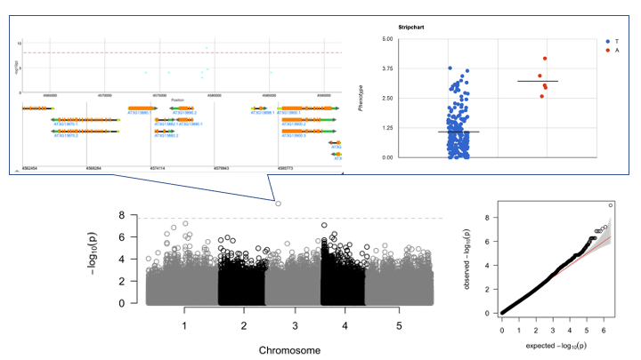

---
output:
  word_document: default
  pdf_document: default
  html_document: default
bibliography: bibliography.bib
csl: biomed-central.csl
---
# Genome-wide association study highlights escape by delayed growth from aphid herbivory on in field-grown *Arabidopsis thaliana*

**Author 1**^1^  
**Author 2**^1,2^  
**Author 3**^1,3^  

^1^ University of XX  
^2^ YY University  
^3^ ZZ University    

# Abstract
Growing number of ecological studies have shown that plant developmental and phenological traits greatly contribute to shaping field herbivory. To reveal genetic bases underlying aphid herbivory, we conducted a genome-wide association study (GWAS) of aphid abundance in a field population of *Arabidopsis thaliana*. Focusing on a single significant peak on the third chromosome, we discovered several growth-related genes and a new locus *NAME OF THE GENE* (*NOG*) that encoded a ribosomal gene (AT3G13882). Knockout mutants of *nog* exhibited slower growth and ca. x-days later flowering than Col-0. Our laboratory bioassay further showed that a colony of the mustard aphid *Lipaphis erysimi* was difficult to establish on *nog* due to its small rosette size. These findings suggest that side effects of life-history traits on biotic interaction play a more critical role *in natura* than currently appreciated.

# Introduction
Plants are attacked by herbivores across their life cycles in natural environments. While chemical and physical traits have long been a main focus of anti-herbivore defense [@schoonhoven2005insect], plant life-history traits also account for herbivory in field environments [@carmona2011plant; @barton2017future]. For example, phenological shifts can allow plants to escape from seasonal herbivory [@kawagoe2010escape; @marquis2021escape]. Plants’ visibility for herbivores, namely plant apparency [@feeny1976plant], often changes from vegetative to reproductive phase, which alters the risk of herbivore attacks across plant ontogeny [@zverev2017ontogenetic; @barton2017future]. By focusing on intraspecific variation within a plant species, several studies have shown that plant apparency shapes heritable variation in herbivory among plant genotypes [@johnson2009heritability; @barbour2015multiple; @sato2019plant], though key genes remain unknown.

Genome-wide association study (GWAS) is increasingly recognized as a powerful approach to dissect the genetic architecture of ecologically important traits [@anderson2011ecological; @santure2018wild] and identify novel genes from natural phenotypic variation [@fujii2019stigmatic; @tsuchimatsu2020adaptive]. However, field studies have suggested that controlled laboratory conditions unlikely reflect outdoor environments where interspecific interactions typically occur [@honjo2020seasonality; @sato2019transcriptional], highlighting the importance of *in natura* study on gene functions [@shimizu2011plant; @kudoh2016molecular; @yamasaki2017genomics; @stockenhuber2021uv]. For *in natura* understanding of interspecific interactions, it is necessary to conduct GWAS under field conditions.

*Arabidopsis thaliana* is the model plant species distributed in Europe and naturalized around the world. While *A. thaliana* usually bloom in spring after over-wintering, some cohorts have overlapped life cycles from spring to autumn [@thompson1994spatiotemporal; @taylor2017interacting; @stockenhuber2021uv]. When plants emerge from late spring to early summer, they are threatened by various herbivores, such as aphids and beetles [@mosleh2009herbivory; @sato2019plant]. Of the diverse insect herbivores, aphids are a major herbivore occurring across a natural distribution range of *A. thaliana* [@zust2012natural]. Because aphids often suck phloem saps from flowering stems, we hypothesized that plant life-history traits may play a key role in aphid colonization in the field.  

To reveal the genetic architecture of aphid herbivory, we combined GWAS and mutant analysis in *A. thaliana*. We first conducted GWAS of aphid abundance on 196 *A. thaliana* accessions grown in a field site of Zurich, Switzerland. Near a GWAS peak, we discovered a new locus *NAME OF THE GENE* (*NOG*) as well as several known genes involved in delayed growth. To further validate the candidate genes, we then cultivated and released the mustard aphid *Lipaphis erysimi* on *A. thaliana* mutants. The field-based discovery of *NOG* will gain genetic insights into plant apparency on insect herbivory *in natura*.

# Materials & Methods

## Field GWAS (*Yasu will fill in this section*).    

### Plants
We selected 196 accessions from RegMap [@horton2012genome] and 1001 Genomes [@alonso20161] projects, most of which were overlapped with previous GWAS of biotic interaction [@horton2014genome]. The list of accessions is available in a supplementary material.

### Field experiment and trait survey
To observe aphids on a simulated late cohort, we exposed *A. thaliana* to field environment from 4 to 25 July in 2018 at a field site within Europe. We initially cultivated eight replicates of the 196 accessions in a laboratory. Seeds are sown on 33-mm diameter Jiffy-seven^(R)^ pots and stratified under a constant dark 4$^\circ$C condition for a week. Seedlings were grown for 6 weeks under a short-day condition (8L:16D cycle with 20$^\circ$C air temperature). Plants were then potted in a plastic pot filled with agricultural soils (3:1L volume ratio of xxxx soils:perlites), and then transferred to the outdoor garden at the University of Zurich-Irchel (Zurich, Switzerland; XX$^\circ$xx'N, YY$^\circ$yy'E). Aphids were counted by a single observer every two or three days. We also recorded the presence or absence of bolting two weeks after the start of field experiment.

### Data analysis
GWAS was performed using the GWA-portal website (https://gwas.gmi.oeaw.ac.at) [@seren2018gwa]. Target phenotypes were the maximum number of aphids per plant throughout the experiment; or presence (1) or absense (0) of bolting. The imputed fullsequence dataset were chosen as SNP data for the 196 accessions. Pseudo-heritability $h^2$ was calculated for each target phenotype before association mapping. Accelerated mixed models were used for association mapping with a correction of kinship structure. The genome-wide significance level was given at $p=0.05$ with Bonferroni correction of multiple testing. The number of aphids was log($x+1$)-transformed to improve normality. Input phenotype data are available as a supplementary material. After the association mapping, candidate genes were searched within ca. 10 kb near a focal SNP. To estimate gene functions from gene expression information, we used the Arabidopsis eFP browser [@winter2007electronic], 1001 transcriptome data [@kawakatsu2016epigenomic], and ATTED-II coexpression database [@obayashi2018atted] (https://atted.jp/).

Gene ontology enrichment analysis was performed for the results of GWA-portal. xxxx. To deal with statistical non-independence of SNPs, we employed an unbiased GO analysis implemented in the Gowinda program [@kofler2012gowinda]. The cut-off value of minor allele frequency (MAF) was set at 0.025 for the entire SNP set, and SNPs having the top 1\% value of -log10($p$) were tested against the entire set. The latest gene feature format (GFF) and GO slim annotation of *A. thaliana* were downloaded from The Arabidopsis Information Resource (TAIR) (https://www.arabidopsis.org/). The Gowinda program was run with the key arguments of --simulations 1000000 --min-significance 1 --gene-definition updownstream1000 --mode gene --min-genes 2.

## Mutant analysis (*Please fill in this section*)

### Plants
T-DNA insertion lines of *A. thaliana* were obtained from the Nottingham Arabidopsis Stock Centre (NASC) (https://arabidopsis.info/).

Please describe  
- which lines did you order?  
- how did you confirm the knockout mutations?  
- how many times did you backcross?  

### Bioassay

Please describe  
- what species of aphids did you use?  
- how did you cultivate plants?  
- how did you construct the experimental arena?  
- how did you record the number of aphids?  

# Results

## Field GWAS of the aphid abundance (*Yasu will fill in this section*)  

We observed the two aphid species *Lipaphis erysimi* and *Brevicoryne brassicae* occurring on the 196 accessions of *A. thaliana* during early summer in Zurich. These aphids more likely colonized on bolted accessions than non-bolted accessions (Fig. X), indicating that the presence of flowering stem affected the aphid colonization. The pseudo-heritability $h^2$ of the aphid number and bolting was 0.7 and nearly 1, respectively. The large heritability suggests that the observed traits are likely under genetic controls and thus deserve further association mapping.   

We then performed GWAS using the accelerated mixed model that corrects a kinship structure. Regarding the aphid number, we observed a significant SNP above the genome-wide Bonferroni threshold (Fig. [1](#fig:ManPlot){reference-type="ref"}). When comparing trait values between two alleles on the significant SNP marker (chr3-xxxxx; MAF=0.026), three of five accessions shared similar haplotypes from AT3G13870 to AT3G13890 locus (Fig. SX), spanning a X kbp region. Several known genes were located near this genomic region. AT3G13870 locus, also known as *ROOT HAIR DEFECTIVE3* (*RHD3*), impacts root hair developments and thus results in slower growth (citation). AT3G13890 locus is known to encode MYB26 transcription factor responsible for the anther dehiscence and male sterility (citation). AT3G13880 (*OTP72*) locus itself has no visible phenotype, but one allele *otp72-2* is known to affect gene the expression level of *RHD3* (citation). Known functions of these candidate genes led us to hypothesize that genes involved in growth or reproduction have side effects on aphid colonization on a plant stem.  

To infer polygenic effects on aphid numbers, we also performed GO enrichment analysis for SNPs having the top 1% score of -log10($p$). We found two significant GOs, "DNA-binding transcription factor activity" and "positive regulation of transcription, DNA-templated" (FDR-adjusted $p<0.05$). Although the other GOs were not significant after the FDR correction, the top 22 categories included GOs involving defense, growth, and reproduction, such as "positive regulation of salicylic acid mediated signaling pathway", "positive regulation of leaf senescence", "pollen tube development" (non-adjusted $p<0.01$: Fig. SX). The results of GO enrichment analysis support the relevance of plant life-history traits as well as defense signaling to the aphid numbers.  

## Mutant analysis in a laboratory (*Please fill in this section*)

### Growth  and flowering of *A. thaliana* mutants

### Aphid attachment experiments

# Discussion (not yet written, combined Results & Discussion possible)
possible topics  
- ecological discussion on the genetic basis of phenological escape from herbivory  
- side effects of ribosomal genes on plant growth (Takashi & Hiro's paper)  
- caveats on other candidates near the GWAS peak  
- summary or concluding paragraph  

# Tables & Figures 

{#fig:ManPlot}  

# References
